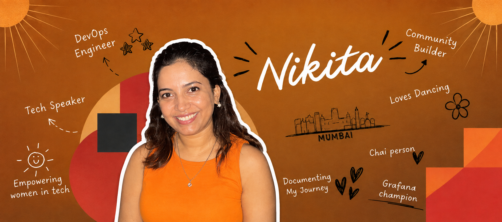

  

  
  
  
  

---

## 🤘 About me

- 👤 **Name:** Nikita Shinde
- 💼 **Senior DevOps / Cloud Engineer** at Abbott
- 📍 **Location:** Navi Mumbai, India
- 📢 **Languages:** English, Hindi, Marathi
- 🎓 **Bachelor of Engineering**
- ☁️ Specializing in cloud distributed systems across AWS, Azure, and GCP, containerized workloads, and observability and reliability
- 🔐 Focused on infrastructure as code, CI/CD automation, security, and operational excellence
- 🤝 Outside my 9 to 5, I am a community organizer and open source contributor for three communities here in Mumbai

> _"If you want to go fast, go alone. If you want to go far, go together."_
> — African Proverb

---

## 🔭 I'm currently ...

- 🔭 Deepening my expertise in Kubernetes, CI/CD and GitOps workflows, SecOps
- ⚙️ Automating engineering workflows and adopting AI thoughtfully to improve developer productivity
- ✍️ Writing about DevOps and cloud engineering on [my blog](https://technerdz.hashnode.dev/)

---

## 🖥️ Tech stack and tools

**☁️ Cloud and Infrastructure**

**🔁 CI/CD and Version Control**

**📊 Observability**

**🗄️ Databases and Streaming**

**💻 Languages and Scripting**

**🤖 AI Tools**

**🗣️ Soft Skills**

---

## 💬 Ask me about

- ⚙️ DevOps workflows and cloud
- 🧭 Career guidance and mentorship
- 👩‍💻 Women who want to transition from non-tech to tech
- 🤝 Collaboration opportunities with communities in Mumbai

---

## 🙋‍♀️ More about me

I grew up in Mumbai and I still stay here with my parents. I am an independent, delulu CEO woman. I love to laugh and I am not too serious in general.

If I had to describe myself in one word, it would be multipotentialite.

When I am not doing anything in particular, you will usually find me practicing dance, reading books, or just staring at nature.

Despite being generally opinionated, I love changing my mind when I learn something new.

COVID hit everybody hard, and that is when I moved from electronics engineering to DevOps. It has been a long journey. I started out simply trying to understand cloud and DevOps during my internship, turned it into a practical craft, and then set my sights on a full-time DevOps role, which I eventually landed after a few switches.

Taking ownership, leading, and volunteering run in my blood, which is how I ended up building and organizing open source communities here in Mumbai, now serving 3000+ members across CNCF Mumbai, Grafana and Friends Mumbai, and Merge & Rise.

Along the way I was named a Grafana Champion, and I have spoken at community events both in Maharashtra and outside the state.

As a woman, I love having other women beside me at community events and tech activities. So if you ever need someone in your corner, I will be the first one cheering for you.

---

## 🎲 Trivia

- 🎸 I started learning guitar but have not finished it yet
- 🎱 I play pool, carrom, and chess at a medium level
- 💃 I’m skilled in various folk dances from across India

---

## 🤝 Working with me

By nature, I am someone who takes a bird's eye view before making any critical decision. I believe the more you scrutinize something, the better you understand it. I am the kind of person who will try to fix a light bulb a hundred times before replacing it.

I aim to deliver high-quality work and I expect the same standard from the people around me. This is a double-edged sword, so to avoid falling into perfectionism, I work hard to scope my work properly and iterate.

I try to be a good listener and to understand what the other person is actually saying before passing any judgment.

I enjoy building deep, personal relationships with the people I work with. If that is not your preferred style of interaction, please feel free to tell me.

I like planning out my day and my week. Not too far ahead, but far enough to know what I will be doing. I appreciate an impromptu plan every now and then, but I prefer structure. You will always find me blocking my calendar, even for the smaller things.

For mindfulness, I keep a journal. I write down the good things I achieve in a week, a month, or a quarter, and it keeps me reminded of how far I have come.

---

## 🌱 What I am working on to improve

- **Communication.** Being more aware of when to use low-context and high-context communication, and articulating myself better in both.
- **Widening my horizon.** Meeting new and existing communities to expand engagement and audience reach, and to build a genuinely nurturing community here in Mumbai.
- **Coaching.** Building my expertise so I can coach others in DevOps, cloud, and the community space.

---

## 📬 Contact

On weekends, when I want to get more creative, I enroll in random workshops and try to show up with confidence.

Want to get in touch? Let's connect on [LinkedIn](https://www.linkedin.com/in/shinde-nikita/). If we do not know each other yet, please share something about yourself in the invitation request.
